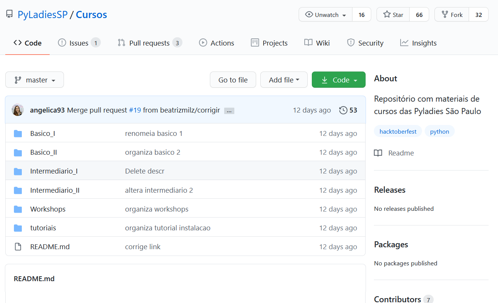
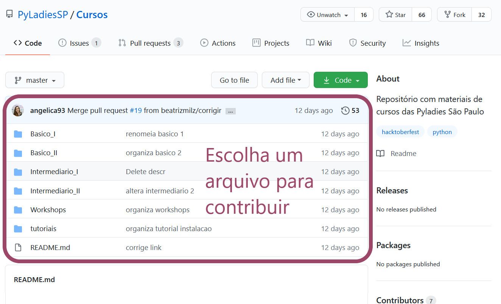
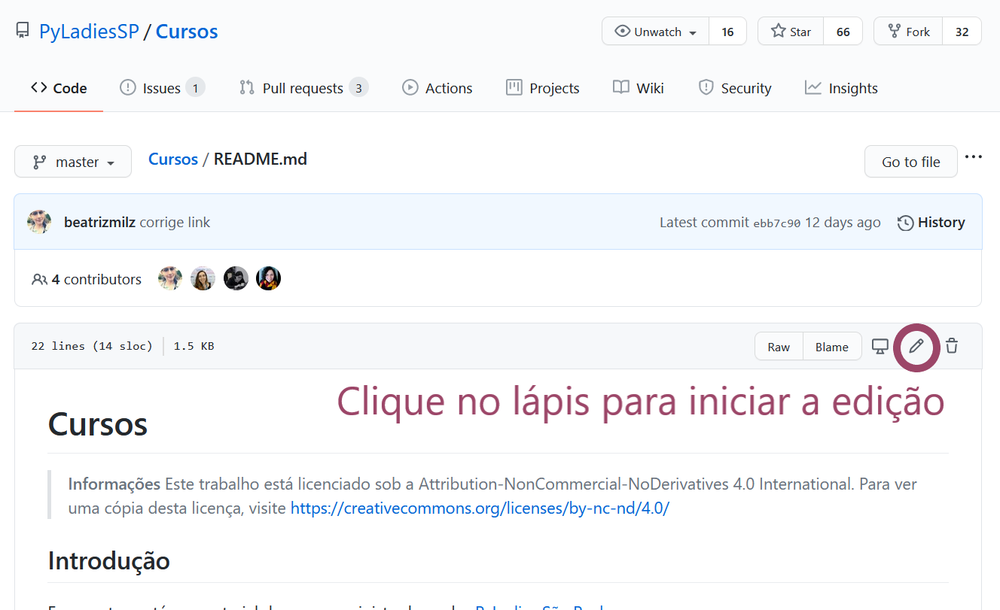
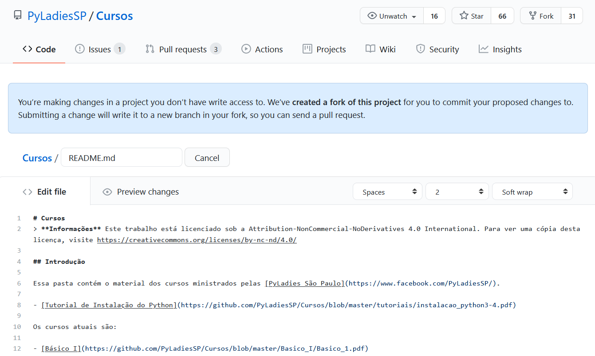

class: middle, center

```{r, child="configuracao.Rmd"}

```


- Contribuímos diretamente do navegador, através do site do GitHub!

- Não é necessário instalar o Git no computador.

- Útil para __contribuições mais simples__, exemplo:

  - Listas

  - Textos marcados com Markdown

  - Traduções
  
  


---

## Escolha um repositório!

Neste exemplo usaremos [este repositório](https://github.com/PyLadiesSP/Cursos) com materiais da PyLadies SP.

```{r echo=FALSE, fig.align='center', out.width="100%"}

```


---

## Escolha um arquivo para contribuir


```{r echo=FALSE, fig.align='center', out.width="100%"}

```


---

## Vamos contribuir no arquivo [README.MD](https://github.com/PyLadiesSP/Cursos/blob/master/README.md)

```{r echo=FALSE, fig.align='center', out.width="100%"}

```

---
class: middle, hide-logo

> "Você está fazendo alterações em um projeto ao qual não tem acesso para escrever. __Nós criamos um fork deste projeto__ para você enviar as alterações propostas. O envio de uma alteração a gravará em um novo branch em seu fork, para que você possa enviar um Pull Request."

```{r echo=FALSE, fig.align='center', out.width="100%"}

```
