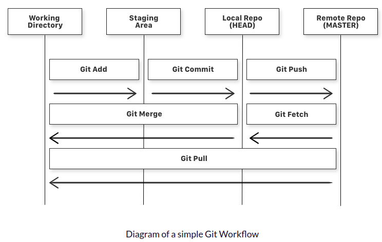
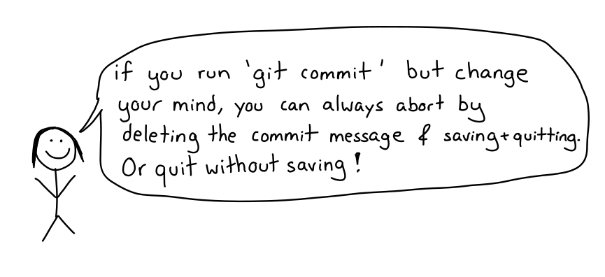
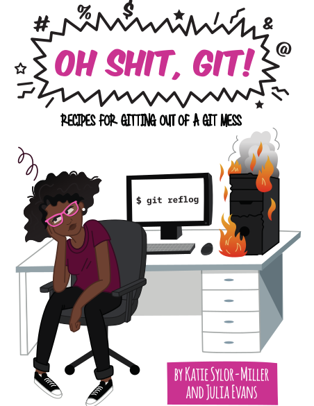

class: middle, center, inverse

```{r, child="configuracao.Rmd"}

```

# O que é Git/GitHub e por que usá-los?

---
# Git é uma ferramenta de controle de versão de arquivos

- Um sistema de controle de arquivos nada mais é do que um sistema que registra alterações em um arquivo ou conjunto de arquivos ao longo do tempo para que você possa recuperar versões específicas posteriormente.

-  Ele permite que você reverta os arquivos para um estado anterior, reverta todo o projeto para um estado anterior, analise as alterações feitas ao longo do tempo, veja quem modificou pela última vez algo que pode estar causando um problema, quem introduziu um problema nos seus arquivos/códigos e muito mais!

---
# Se o git é o coração do Git o hub do GitHub é a alma!

- GitHub é a principal rede social dos desenvolvedores e onde podemos compartilhar tudo o que versionamos usando o git.

- Além disso é onde contrubuimos com outros projetos, fazemos perguntas e trocamos conhecimentos com outras pessoas, pois podemos seguir pessoas e acompanhar o que fazem ou com quem se comunicam.


---
# Fluxo de trabalho e conceitos-chave

- Repositório: (ou só repo) é uma coleção de arquivos (geralmente de códigos)

- Local repository: (repositório local) é uma coleção de arquivos mantidos em nosso computador pessoal

- Remote repository: repositório remoto é a famosa nuvem, ou mais precisamente os servidores do GitHub para o qual enviamos o conteúdo de nosso repositório local para que possamos compartilhar com outras pessoas

- Working directory: pasta/diretório onde mantemos nossa coleção de arquivos e onde trabalhamos com eles.

---
# Fluxo de trabalho

```{r out.width="90%"}

```

---
# Um arquivo do seu working directory pode assumir 3 estados possíveis:

- Ele pode ser alterado: ou seja, os arquivos com as mudanças atualizadas ainda não estão armazenados no repositório local.

- Ele pode estar na área de stag (staging area): ou seja, os arquivos com as mudanças atualizadas estão marcados para serem commitados no repositório local, mas ainda não foram commitados

- Ele pode ser commitado (commit area): ou seja, as alterações feitas em seu arquivo são armazenadas com segurança no repositório local.


---

## Comentários 

- Você pode usar o Git através:
  -  __Linha de comando__ :
      - [git](https://git-scm.com/)
      - terminal do RStudio
  - __Interfaces gráficas__:
      - [GitHub Desktop](https://desktop.github.com/)
      - [Sourcetree](https://www.sourcetreeapp.com/)
      - Git Pane do RStudio
      - Entre outros!
    
Logo apresentaremos como utilizar através do RStudio, mas escolha o que é mais confortável para você :)

- Independente de qual ferramenta você escolher, é importante qual comando do Git equivale a um "botão" na interface gráfica. É muito importante entender as equivalências!


---
class: center, middle 

## Linha de comando ou interface gráfica?
## Use o que for melhor para **você**!

```{r out.width="50%"}
knitr::include_graphics("https://media0.giphy.com/media/dNgK7Ws7y176U/giphy.gif")
```

---
## Branch

É uma série independente de *commits*, que pode ser usada para criar novas funcionalidades, etc.

*Branch master*: é o ramo principal

Demais *branches*: derivam da master e podem retornar a ela depois


```{r out.width="50%"}

```


---
## Commit

É o ato de enviar / fazer um upload dos códigos na sua *branch*.

Sempre precisa de uma mensagem breve explicando o que foi feito.

Dica: Faça *commits* incrementais!

```{r out.width="80%"}

```

---
## Checkout

Muda para outra *branch*.

Antes de trocar de branch verifica se há alteração não "commitada" nos arquivos, se existir, ele dá um alerta e não troca de branch até você resolver o que fazer.

```{r out.width="60%"}

```


---
## Issue

Usada para:
- discutir funcionalidades,
- reportar e monitorar bugs,
- sugerir melhorias,
- etc.

```{r out.width="50%"}
knitr::include_graphics("https://media.giphy.com/media/ekje2HEQqJW7cE9SIJ/giphy.gif")
```


---
## Wiki

Desenvolvido originalmente por [Ward Cunningham](https://pt.wikipedia.org/wiki/Ward_Cunningham)

é um importante recurso de documentação dos projetos.

<br>
<br> 

```{r out.width="50%"}

```


---
## Readme.md

Arquivo que apresenta o projeto e informações adicionais.

- como instalar,
- como usar o código,
- como fazer contribuições com o projeto, 
- etc.

```{r out.width="50%"}
knitr::include_graphics("https://media.giphy.com/media/l4FGJfimoW3Cl6gDK/giphy.gif")
```


---
class: center

## Dicas

[GIT CHEAT SHEET](https://education.github.com/git-cheat-sheet-education.pdf)

```{r echo=FALSE, fig.align='center', out.width="40%"}

```

