class: middle, center, inverse

```{r, child="configuracao.Rmd"}

```


# O que é Github?

---
class: hide-logo, center, middle

O Github é uma plataforma de hospedagem de código e arquivos com controle de versão usando o Git. 

Funciona como uma rede colaborativa, onde as pessoas colocam seus projetos para desenvolvimento e hospedagem do código.

```{r echo=FALSE, out.width="70%"}
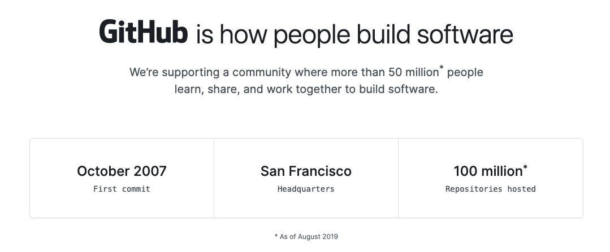
```

---
## Visão Geral do Github

```{r echo=FALSE, out.width="70%"}
knitr::include_graphics("img/github.PNG")
```

---

## Algumas funcionalidades 

- Documentação em Repositórios

- Pull requests com comentário e revisão de código

- Histórico de commits

- Notificações por email

- Arquivos podem ser vistos e comparados com versões anteriores

- GitHub Pages: pequenos websites podem ser feitos.


---

## Repositórios

```{r echo=FALSE, out.width="80%"}
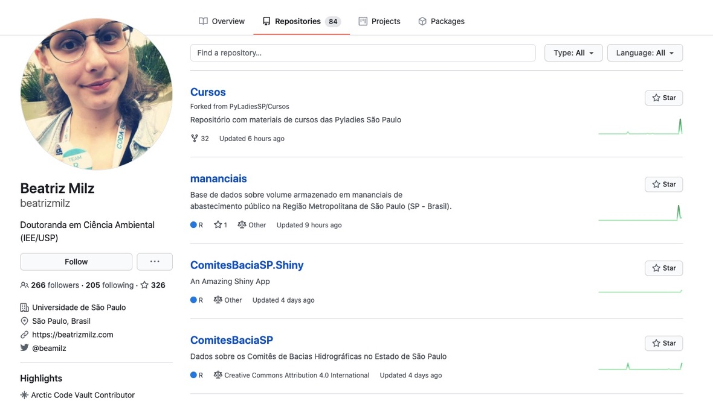
```

---

## Criando um Repositório

```{r echo=FALSE, out.width="70%"}
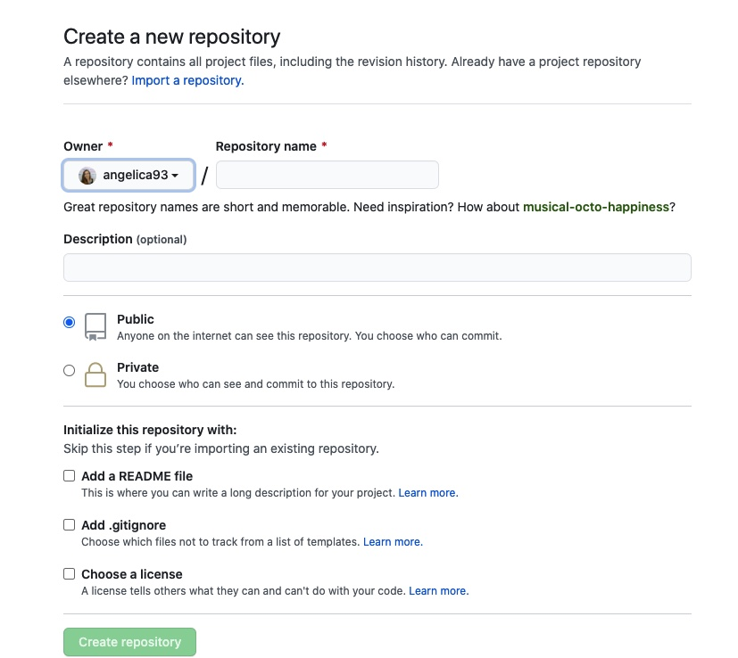
```

---

## Contribuindo em um Repositório

```{r echo=FALSE, out.width="90%"}
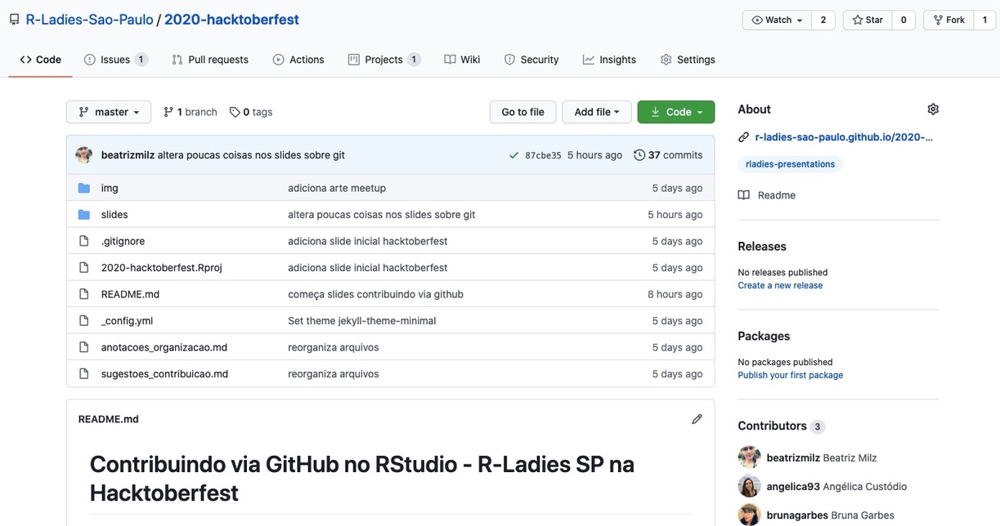
```

---

## Fork em um Repositório

Fazendo o Fork

```{r echo=FALSE, out.width="90%"}
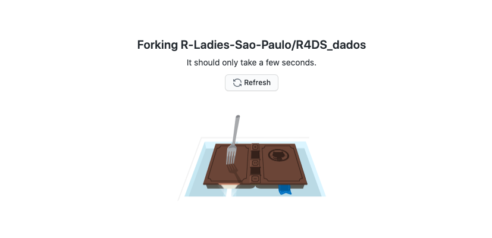
```


---

## Fork em um Repositório


```{r echo=FALSE, out.width="100%"}
knitr::include_graphics("img/fork2.jpeg")
```


---

## Commit em um Repositório


```{r echo=FALSE, out.width="100%"}
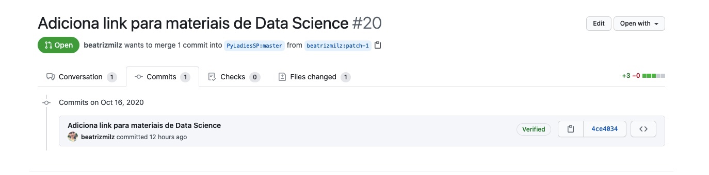
```


---

## Pull Request em um Repositório


```{r echo=FALSE, out.width="100%"}
knitr::include_graphics("img/github6.jpeg")
```

---

## Pull Request em um Repositório


```{r echo=FALSE, out.width="80%"}
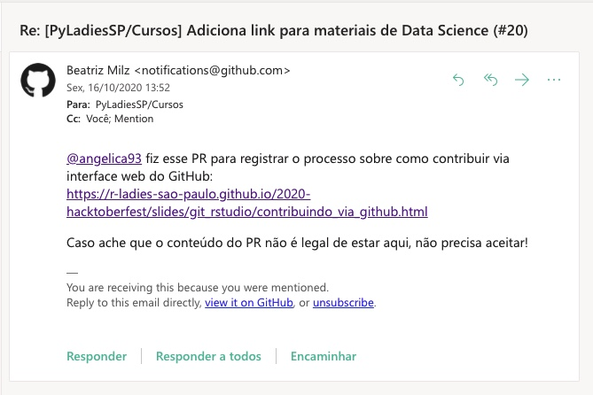
```

---

## Histórico de commits


```{r echo=FALSE, out.width="100%"}
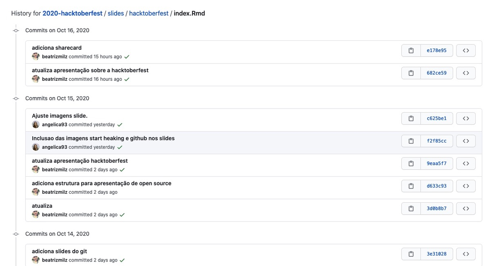
```

---

## Histórico dos arquivos


```{r echo=FALSE, out.width="100%"}
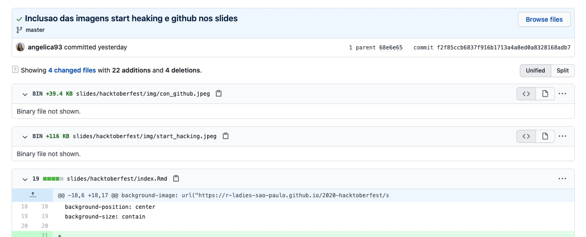
```

---

## Histórico dos arquivos


```{r echo=FALSE, out.width="100%"}
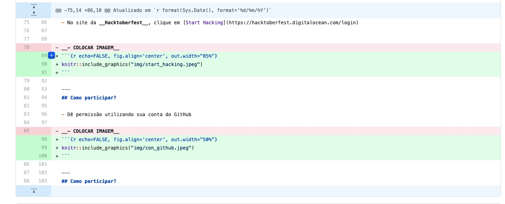
```


---

## Clonando um Repositório na sua máquina local


```{r echo=FALSE, out.width="50%"}
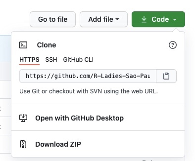
```

---

## Github Page


```{r echo=FALSE, out.width="100%"}
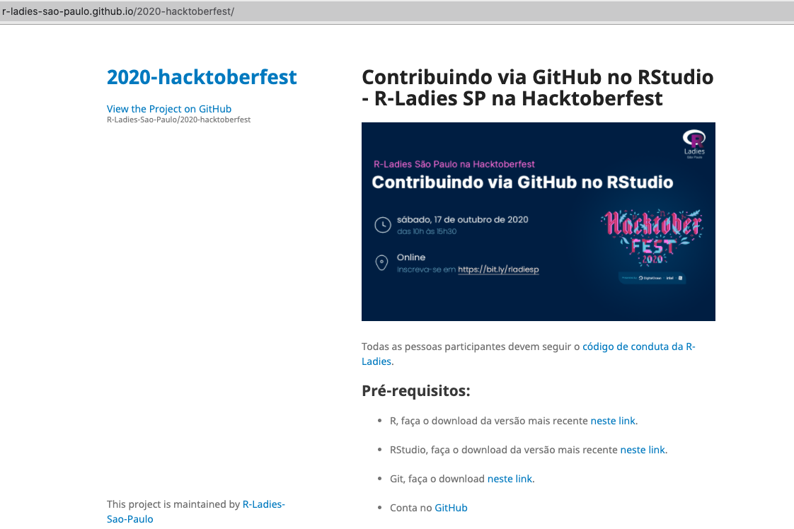
```

---

## Github Page


```{r echo=FALSE, out.width="100%"}
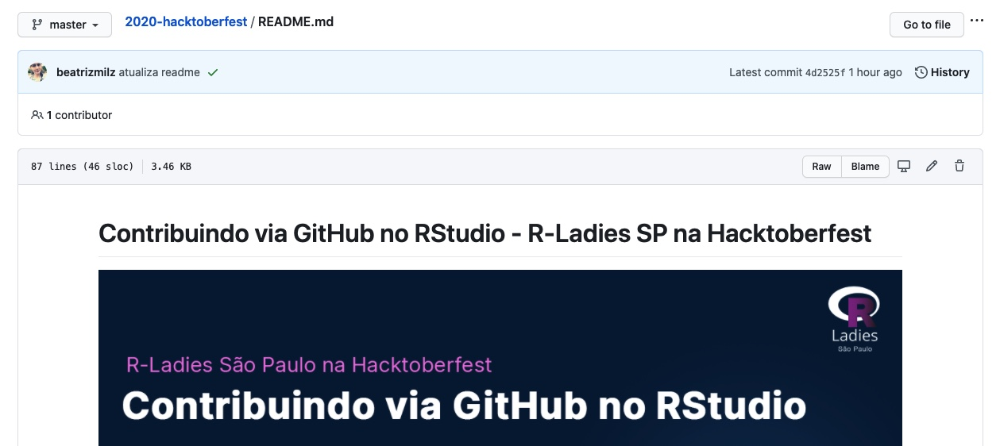
```


---

## Github também é rede social


```{r echo=FALSE, out.width="100%"}
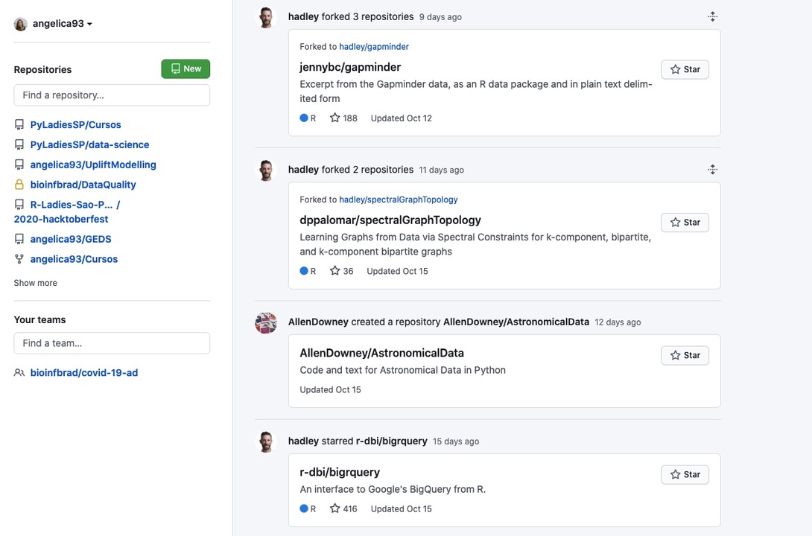
```
