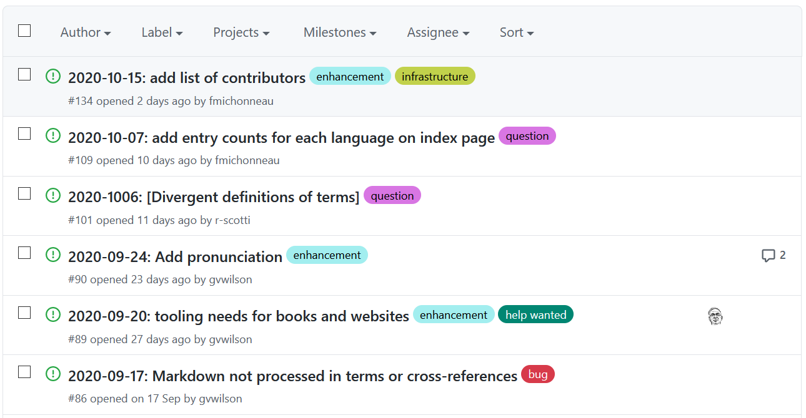
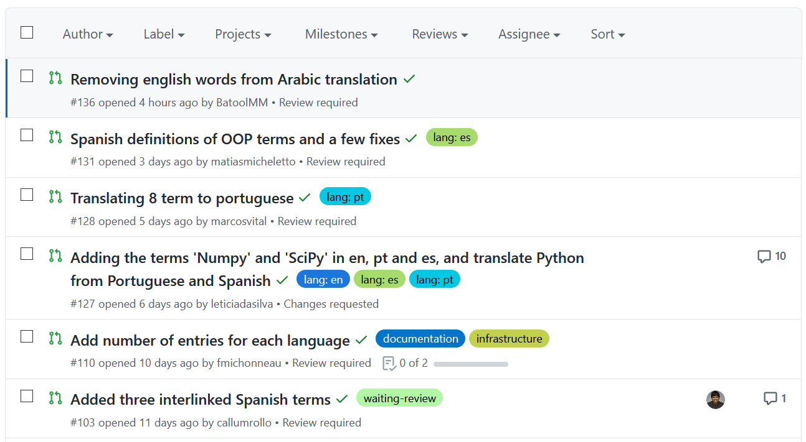
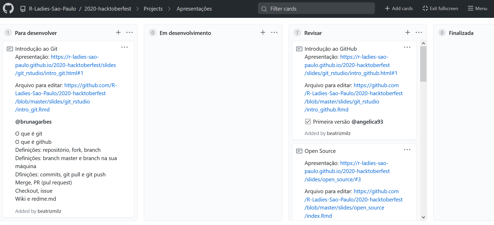
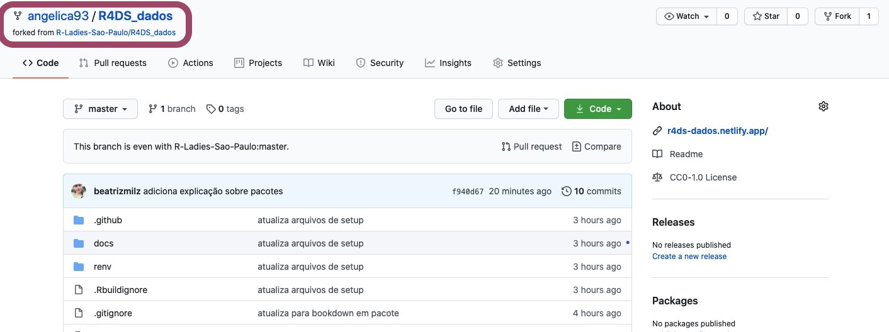
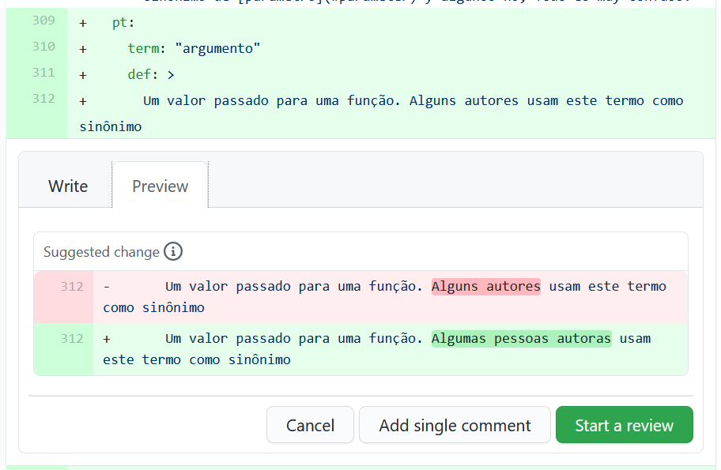

class: middle, center, inverse

```{r, child="configuracao.Rmd"}

```


# O que é Github?
--

## Uma introdução!
---
class: hide-logo, center, middle

O Github é uma plataforma de hospedagem de código e arquivos com controle de versão usando o Git. 

Funciona como uma rede colaborativa, onde as pessoas colocam seus projetos para desenvolvimento e hospedagem do código.

```{r echo=FALSE, out.width="70%"}
knitr::include_graphics("img/github_about.jpeg")
```

---
## Visão Geral do Github

```{r echo=FALSE, out.width="70%"}
knitr::include_graphics("img/github.PNG")
```

---

## Algumas funcionalidades 

- Documentação em Repositórios

- Pull requests com comentário e revisão de código

- Histórico de commits

- Notificações por email

- Arquivos podem ser vistos e comparados com versões anteriores

- GitHub Pages: websites estáticos podem ser feitos.


---

## Repositórios

```{r echo=FALSE, out.width="80%"}
knitr::include_graphics("img/github2.jpeg")
```

---

## Criando um Repositório seu

```{r echo=FALSE, out.width="70%"}
knitr::include_graphics("img/github4.jpeg")
```

---

## Repositórios

```{r echo=FALSE, out.width="90%"}
knitr::include_graphics("img/github3.jpeg")
```

---

## Issues do repositório

- Sugestões de melhorias, erros encontrados, etc.

```{r echo=FALSE, out.width="90%"}

```

Exemplo das issues do repositório [carpentries/glosario](https://github.com/carpentries/glosario/issues).


---

## Pull Requests do repositório

- Contribuição com __CÓDIGOS__ envolvendo melhorias, arrumando erros encontrados, etc.

```{r echo=FALSE, out.width="90%"}

```

Exemplo dos pull requests do repositório [carpentries/glosario](https://github.com/carpentries/glosario/issues).

---

## Projetos do repositório

- É interessante para organizar as tarefas! 

- Possível marcar:
  - pessoas usando `@nomeusuarie`,
  - issues e PRs do repositório usando `#1` (substitua o 1 pelo número do PR ou Issue)
  - issues e PRs de outros repositórios utilizando o final da url, por exemplo `gabrielacaesar/segurancaSP/issues/13`.

```{r echo=FALSE, out.width="90%"}

```


---

## Fork em um Repositório

Fazendo o Fork do repositório __de outra pessoa__ cria uma cópia deste repositório na sua conta, para que você possa trabalhar na sua contribuição e enviá-la depois.

```{r echo=FALSE, out.width="90%"}
knitr::include_graphics("img/fork.png")
```


---

## Fork em um Repositório


```{r echo=FALSE, out.width="100%"}

```


---

## Commit em um Repositório


```{r echo=FALSE, out.width="100%"}
knitr::include_graphics("img/github7.jpeg")
```


---

## Pull Request em um Repositório


```{r echo=FALSE, out.width="100%"}
knitr::include_graphics("img/github6.jpeg")
```

---

## Pull Request em um Repositório


```{r echo=FALSE, out.width="80%"}
knitr::include_graphics("img/github8.jpeg")
```

---

## Revisão e sugestões no conteúdo dos PRs

```{r echo=FALSE, out.width="80%"}

```


---

## Histórico de commits


```{r echo=FALSE, out.width="100%"}
knitr::include_graphics("img/github9.jpeg")
```

---

## Histórico dos arquivos


```{r echo=FALSE, out.width="100%"}
knitr::include_graphics("img/github11.jpeg")
```

---

## Histórico dos arquivos


```{r echo=FALSE, out.width="100%"}
knitr::include_graphics("img/github10.jpeg")
```


---

## Clonando um Repositório na sua máquina local


```{r echo=FALSE, out.width="50%"}
knitr::include_graphics("img/github15.jpeg")
```

---

## Github Pages


```{r echo=FALSE, out.width="100%"}
knitr::include_graphics("img/github12.png")
```

---

## Github Pages


```{r echo=FALSE, out.width="100%"}
knitr::include_graphics("img/github13.jpeg")
```


---

## É possível seguir pessoas e projetos

É uma forma de acompanhar o que as pessoas da comunidade tem feito!

```{r echo=FALSE, out.width="100%"}
knitr::include_graphics("img/github14.jpeg")
```

---
class: inverse, middle, center

## E muito mais!


