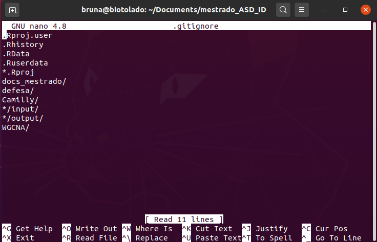

class: middle, center, inverse

```{r, child="configuracao.Rmd"}

```


# O que é um arquivo .gitignore?

---

## Comentários 

- É um arquivo de texto que diz ao git quais arquivos (ou padrões) ele deve ignorar. 

- Geralmente ele é usado para evitar o envio de arquivos temporários de seu diretório de trabalho que não são úteis para outros colaboradores, como produtos de compilação, arquivos temporários criados por IDEs, etc.

- Um exemplo são os arquivos com a extensão .RProj que são criados quando trabalhamos com projetos no RStudio.
    
---
class: center, middle 

## Exemplo de um arquivo .gitignore


```{r echo=FALSE, out.width="70%"}

```
