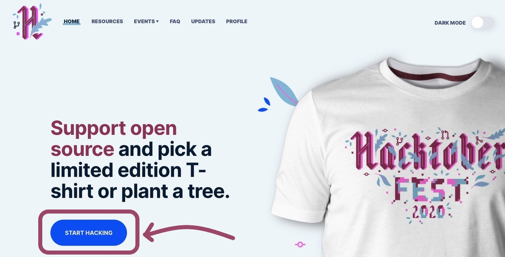
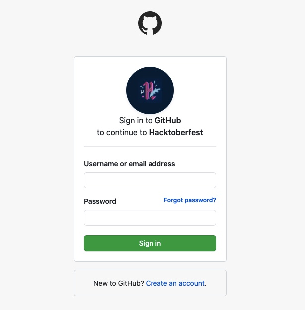
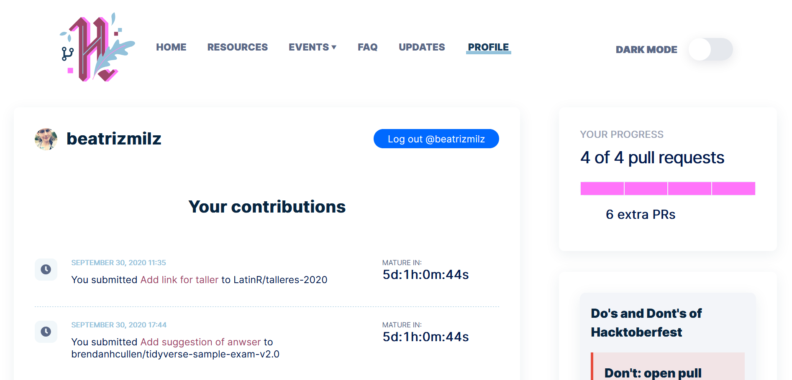
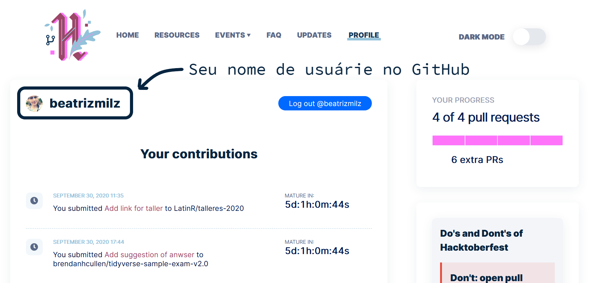
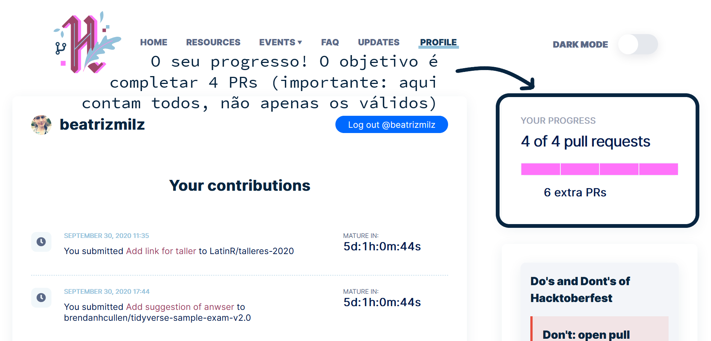
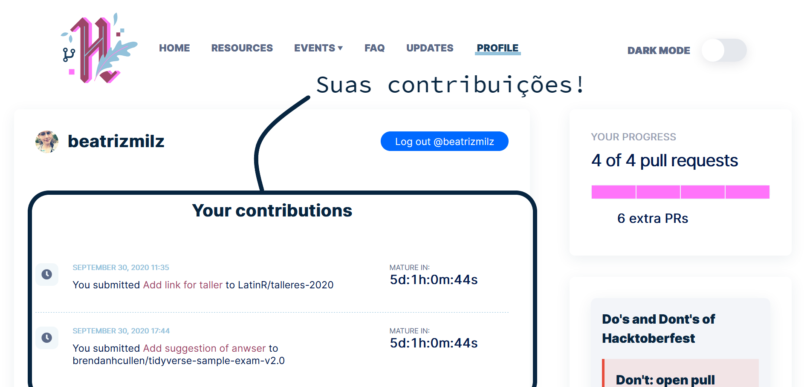
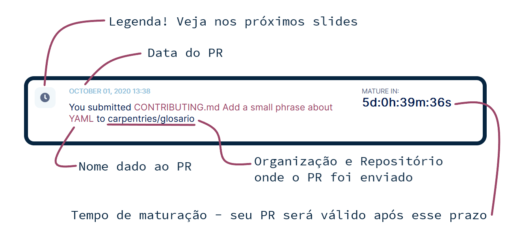

class: title-slide, center
background-image: url("https://r-ladies-sao-paulo.github.io/2020-hacktoberfest/slides/hacktoberfest/img/hf2020-background.png")
background-position: center
background-size: contain


```{r eval=FALSE, include=FALSE}
#devtools::install_github("hadley/emo", dependencies = TRUE)
#install.packages("sysfonts")
#install.packages("showtext")
#install.packages("xaringan")
#install.packages("xaringanthemer")
#install.packages("metathis")
#devtools::install_github("gadenbuie/xaringanExtra")
```

```{r setup, include=FALSE}
options(htmltools.dir.version = FALSE)
```

```{r xaringan-themer, include=FALSE, warning=FALSE}
library(xaringanthemer)
style_duo_accent(
  primary_color = "#072540",
  secondary_color = "#9c4668",
  inverse_header_color = "#FFFFFF"
)
```

```{r xaringanExtra, echo=FALSE}
xaringanExtra::use_logo(
  image_url = "img/Icon.png",
  link_url = "https://r-ladies-sao-paulo.github.io/2020-hacktoberfest/")

```


 R-Ladies São Paulo


Atualizado em `r format(Sys.Date(), format='%d/%m/%Y')`


---

## O que é a **Hacktoberfest**?

- É uma celebração do __open source__ que ocorre em outubro.

- A **Hacktoberfest** é aberta para todes!

- Pessoas fazem contribuições em projetos abertos.

- Caso faça contribuições válidas (de acordo com as regras), pode ganhar uma camiseta. `r emo::ji("shirt")`


---
## Regras para receber o prêmio

- Necessário realizar 4 contribuições válidas, através de __Pull Requests__ no [GitHub](https://github.com).

- Para ser uma contribuição válida:

**EM BREVE**


---
## Como participar?

- No site da __Hacktoberfest__, clique em [Start Hacking](https://hacktoberfest.digitalocean.com/login)


```{r echo=FALSE, fig.align='center', out.width="85%"}

```

---
## Como participar?

- Dê permissão utilizando sua conta do GitHub

```{r echo=FALSE, fig.align='center', out.width="50%"}

```

---
## Como participar?

- [Nesta página](https://hacktoberfest.digitalocean.com/profile) ficarão listados as suas contribuções, com uma legenda sobre o status da sua contribuição. Exemplo:

```{r echo=FALSE, fig.align='center', out.width="80%"}

```


---
class: middle, center

```{r echo=FALSE, fig.align='center', out.width="100%"}

```

---
class: middle, center

```{r echo=FALSE, fig.align='center', out.width="100%"}

```


---
class: middle, center

```{r echo=FALSE, fig.align='center', out.width="100%"}

```

---
class: middle, center

```{r echo=FALSE, fig.align='center', out.width="100%"}

```

---

## Legenda (parte 1!)

-   __Em Revisão__: Seu PR foi aceito por uma pessoa mantenedora e atualmente está dentro do período de revisão, que dura quatorze dias. 

-   __Pendente__: Seu PR ainda não foi aceito por uma pessoa mantenedora. Uma mantenedora pode aceitar seu PR caso faça o `merge`, adicionando o rótulo "hacktoberfest-aceito" ou aprovando-o. 

-   __Inválido__: Seu PR foi rotulado como "inválido" ou "spam" por uma mantenedora e não contará para a Hacktoberfest.

---

## Legenda (parte 2!)


-  __Repositório não elegível__: Seu PR foi enviado para um repositório que não está participando da Hacktoberfest. As mantenedoras do repositório podem adicionar o rótulo "hacktoberfest" ao seu repositório se desejarem participar. Alternativamente, um PR individual pode ser optado por uma mantenedora adicionando o rótulo "hacktoberfest-aceito" ao PR. 


-  __Aceito__: Parabéns! Seu PR passou no período de revisão e conta para a conclusão do desafio da Hacktoberfest!


---
class: inverse, center, middle

## Bom evento! `r emo::ji("woman_technologist")`


Caso tenha dúvidas, veja as [perguntas frequentes](https://hacktoberfest.digitalocean.com/faq)!
