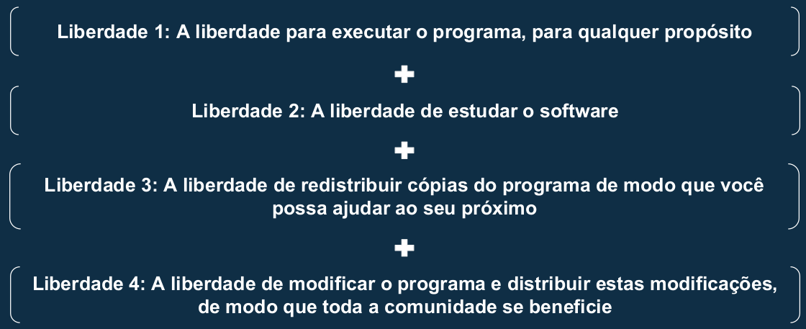
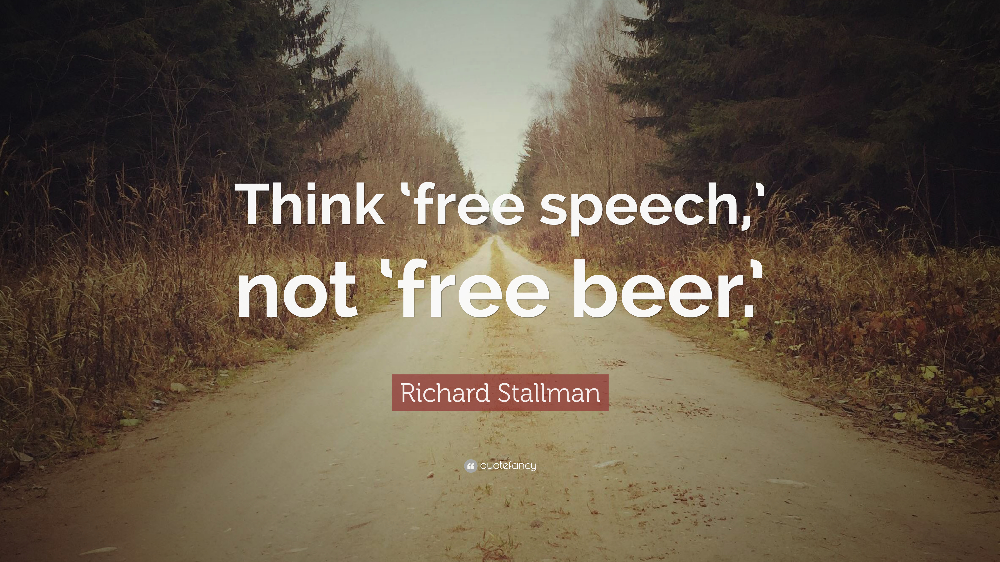
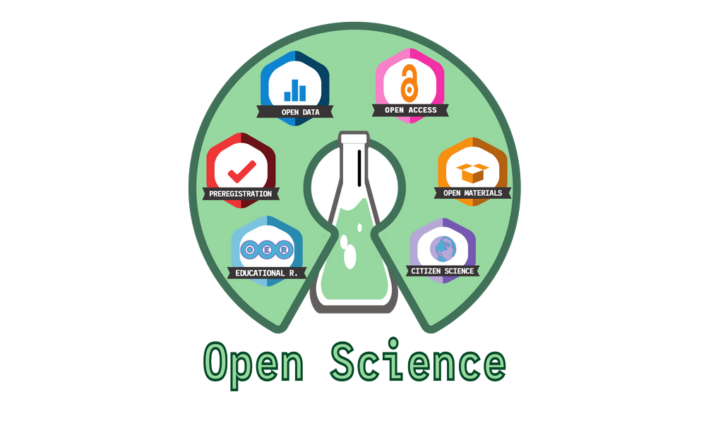
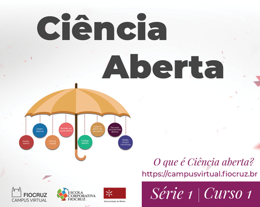
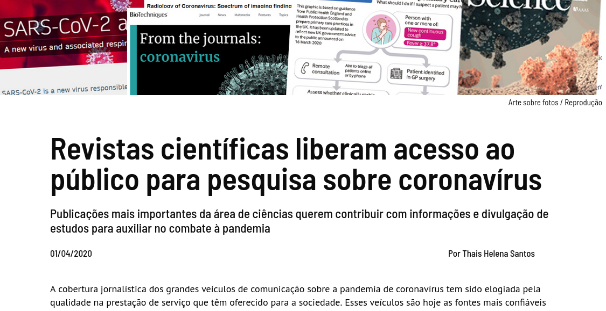
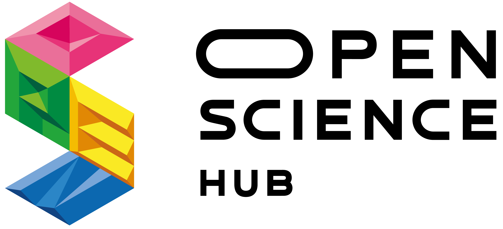
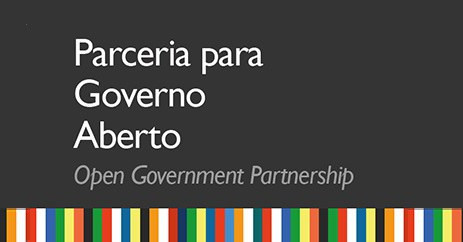
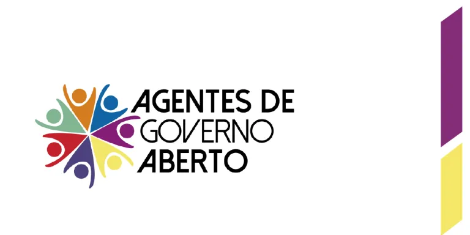
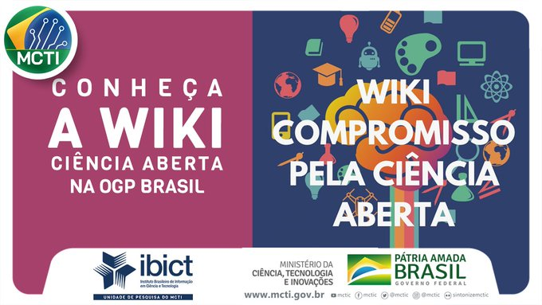
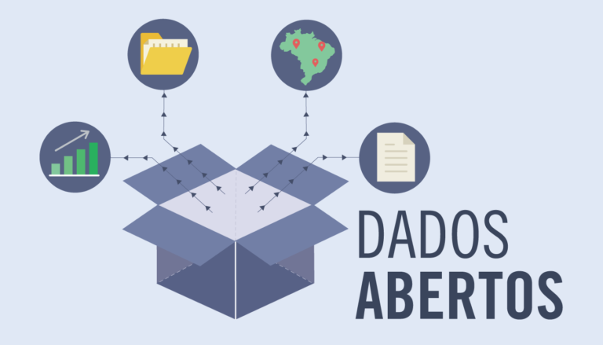

class: center

```{r setup, include=FALSE}
options(htmltools.dir.version = FALSE)

knitr::opts_chunk$set(fig.align = "center",
                      message = FALSE,
                      warning = FALSE,
                      echo = FALSE
                      )
```

```{r xaringan-themer, include=FALSE, warning=FALSE}
library(xaringanthemer)
style_duo_accent(
  primary_color = "#072540",
  secondary_color = "#9c4668",
  inverse_header_color = "#FFFFFF"
)
```

```{r xaringanExtra, echo=FALSE}
xaringanExtra::use_logo(
  image_url = "img/Icon.png",
  link_url = "https://r-ladies-sao-paulo.github.io/2020-hacktoberfest/")

```

```{r metathis, echo=FALSE}
library(metathis)
meta() %>%
  meta_name("github-repo" = "R-Ladies-Sao-Paulo/2020-hacktoberfest") %>% 
  meta_social(
    title = "R-Ladies São Paulo na Hacktoberfest 2020 - Open Source e a colaboração",
    description = paste(
      "Apresentação sobre Open Source"
    ),
    url = "https://r-ladies-sao-paulo.github.io/2020-hacktoberfest/slides/open_source/",
    image = "https://r-ladies-sao-paulo.github.io/2020-hacktoberfest/slides/open_source/img/Open.jpg",
    image_alt = paste(
      "Primeiro slide da apresentação sobre ",
      "open source e a colaboração.",
      "Apresentado por Haydée Svab."
    ),
    og_type = "website",
    og_author = "Haydée Svab",
    twitter_card_type = "summary_large_image",
    twitter_creator = "@hsvab"
  )
```

## Free/Libre Open Source Software

```{r echo=FALSE, fig.align='center', out.width="50%"}
knitr::include_graphics("img/free_and_open_source_logo_by_doctormo_d38z7tl.png")
```

[Fonte da imagem: Deviantart](https://www.deviantart.com/doctormo/art/Free-and-Open-Source-Logo-196478553)
---

class: center
## As 4 liberdades do SL

```{r echo=FALSE, fig.align='center', out.width="105%"}

```


```{r echo=FALSE, fig.align='center', out.width="15%"}
knitr::include_graphics("img/Heckert_GNU_white.svg")
```

---

class: center
## It is about freedom

```{r echo=FALSE, fig.align='center', out.width="100%"}

```

---

class: center
## A Iniciativa Open Source

```{r echo=FALSE, fig.align='center', out.width="45%"}
knitr::include_graphics("img/Opensource.svg")
```

---

class: 
## Definição de Código Aberto


A Definição de Código Aberto foi originalmente derivada do [Debian Free Software Guidelines](https://www.debian.org/social_contract#guidelines):

1. Redistribuição livre
2. Acesso ao código fonte e distribuição do mesmo, também na forma compilada
3. Permissão para fazer modificações e trabalhos derivados
4. Integridade do código-fonte do autor
<!--(A licença pode restringir o código-fonte de ser distribuído na forma modificada apenas se a licença permitir a distribuição de "arquivos de patch" com o código-fonte com o propósito de modificar o programa no momento da construção.)-->
5. Sem discriminação contra pessoas ou grupos
6. Sem discriminação contra campos de atuação
7. Distribuição de licença 
<!--(Os direitos vinculados ao programa devem se aplicar a todos a quem o programa é redistribuído sem a necessidade de execução)-->
8. A licença não deve ser específica para um produto
<!--(Os direitos associados ao programa não devem depender do programa ser parte de uma distribuição de software específica. Se o programa for extraído dessa distribuição e usado ou distribuído dentro dos termos da licença do programa, todas as partes para as quais o programa é redistribuído devem ter os mesmos direitos que aqueles concedidos em conjunto com a distribuição original do software.)-->
9. A licença não deve restringir outro software
<!--(A licença não deve impor restrições a outro software distribuído junto com o software licenciado. Por exemplo, a licença não deve exigir que todos os outros programas distribuídos no mesmo meio sejam software de código aberto.)-->
10. A licença deve ser neutra em termos de tecnologia
<!--(Nenhuma disposição da licença pode ser baseada em qualquer tecnologia individual ou estilo de interface.)-->


---

class: center
## Movimento e Cultura

```{r echo=FALSE, fig.align='center', out.width="85%"}

```


---

class: center
## Recursos Educacionais

```{r echo=FALSE, fig.align='center', out.width="40%"}
knitr::include_graphics("img/Global_Open_Educational_Resources_Logo.svg")
```

```{r echo=FALSE, fig.align='center', out.width="40%"}

```

Fontes das Imagens: [OER - Wikipedia-en](https://en.wikipedia.org/wiki/Open_educational_resources) e [REA PPGEL-UFRN](https://sites.google.com/site/glossarioestudosdeletramento/home/recursos-educacionais-abertos---rea)

---

class: center
## Recursos Educacionais

```{r echo=FALSE, fig.align='center', out.width="40%"}

```

```{r echo=FALSE, fig.align='center', out.width="40%"}

```

Fontes das Imagens: [Moodle - IFMG](https://www.ifmg.edu.br/ourobranco/noticias/curso-do-moodle-esta-disponivel-para-os-alunos-do-campus-ouro-branco) e [REA UAB](https://repositorioaberto.uab.pt/handle/10400.2/4664)

---


class: center
## Ciência

```{r echo=FALSE, fig.align='center', out.width="40%"}

```

```{r echo=FALSE, fig.align='center', out.width="40%"}

```

Fontes das imagens [The American Ceramic Society](https://ceramics.org/ceramic-tech-today/acers-news/open-science-open-access-projekt-deal-and-ijces)
e [FioCruz](https://mooc.campusvirtual.fiocruz.br/rea/ciencia-aberta/serie1/curso1/aula1.html)

---


class: center
## Ciência

```{r echo=FALSE, fig.align='center', out.width="80%"}

```

--
```{r echo=FALSE, fig.align='center', out.width="35%"}

```

Fontes das imagens: [Jornal da USP](https://jornal.usp.br/universidade/revistas-cientificas-liberam-acesso-ao-publico-para-pesquisa-sobre-coronavirus/)
e [OpenScienceHub](https://oshub.network/)


---


class: center
## Governo

```{r echo=FALSE, fig.align='center', out.width="80%"}

```
Fonte da imagem: [CGU](https://www.gov.br/cgu/pt-br/governo-aberto/noticias/2017/3o-plano-de-acao-nacional-na-parceria-para-governo-aberto)

---

class: center
## Governo

```{r echo=FALSE, fig.align='center', out.width="40%"}

```

--
```{r echo=FALSE, fig.align='center', out.width="55%"}

```

Fontes das imagens: [Prefeitura de São Paulo](https://www.prefeitura.sp.gov.br/cidade/secretarias/governo/governo_aberto_na_cidade_de_sao_paulo/index.php?p=280506)
e [MCTIC](https://twitter.com/mctic/status/1304505551695556610)

---

class: center
## Dados
```{r echo=FALSE, fig.align='center', out.width="45%"}
knitr::include_graphics("img/opendata.jpg")
```

```{r echo=FALSE, fig.align='center', out.width="45%"}

```

Fontes das imagens: [Open Data - JulieBeck](https://blog.scielo.org/blog/2014/07/14/movimento-open-data-se-consolida-internacionalmente/) e [Dados Abertos - Artigo 19](https://artigo19.org/blog/2017/09/20/o-que-sao-dados-abertos/)


---
class: title-slide 
## Como contribuir?

--

- **Código em si** - claro!
(desenvolvendo novas funções, automatizando o projeto, corrigindo erros, melhorando ferramentas e criando pacotes, etc.)

--

- **Qualidade**
(report de erros e bugs (*issues*), testes, 

--

- **Organização do projeto**
(organização de labels e milestones para tarefas, revisão de issues abertas/fechadas, etc.)

--

- **Produção escrita/artística**
(documentação técnica e não técnica do projeto, material gráfico, traduções - i.e pacote de dados)

--

- **Comunicação**
(moderação perguntas nos canais de comunicação, apoio a eventos, respostas a perguntas no Stack Overflow, Reddit, GitHub, etc.)

--

- **Ensino-aprendizagem**
(elaboração de tutoriais, realização de cursos e workshops, mentoria de pessoas no projeto, etc.)

--

- **Eventos**
(fortalecimento da comunidade, espírito de troca e colaboração)


---
class: title-slide, center
## Como contribuir?

###Para inspirar:

[**Como Contribuir para o Open Source** - *Quer contribuir para o open source? Um guia sobre como fazer contribuições, para novatos e veteranos*](http://opensource.guide/pt/how-to-contribute/)

[**Como contribuir com projetos de código aberto sem precisar entender de programação** - *Open source é muito mais sobre colaboração do que sobre código*   por Talita Pagani](https://medium.com/@talitapagani/como-contribuir-com-projetos-de-c%C3%B3digo-aberto-sem-precisar-entender-de-programa%C3%A7%C3%A3o-318f94c6e2d3)


```{r echo=FALSE, fig.align='center', out.width="95%"}

```
Fonte da imagem: [Ubuntu Summit](http://ubuntusummit.org/index.php/pt/ubuntu-summit-pt)

---
class: title-slide, center
## Como contribuir?

###Ferramenta de versionamento: GIT

####Um sistema de controle de versões distribuído que permite a colaboração

```{r echo=FALSE, fig.align='center', out.width="45%"}
knitr::include_graphics("img/gitlab.png")
```

```{r echo=FALSE, fig.align='center', out.width="20%"}
knitr::include_graphics("img/github1.png")
```
<center>GITHUB</center>

--


